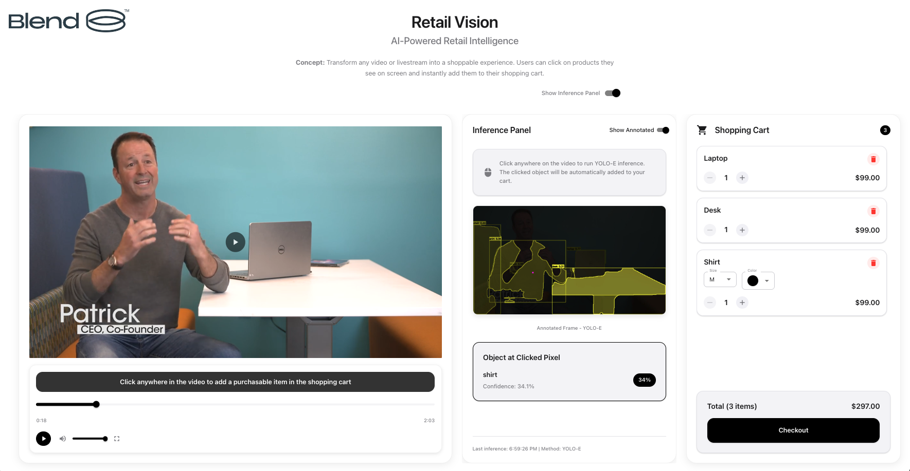

# Retail Vision

A computer vision application that enables users to click on objects in videos and purchase them. Built with YOLO-E segmentation models and a modern web interface.

## Project Overview

Retail Vision transforms passive video watching into an interactive shopping experience. Using advanced computer vision and machine learning, the application:

- **Detects and segments objects** in video frames using YOLO-E models
- **Enables click-to-purchase** functionality for identified products
- **Provides instant product recognition** using YOLO-E with MobileCLIP text prompts
- **Under Armour branded** with custom video, logo, and tagline



## Architecture

The project consists of two main services:

### 1. Backend API (FastAPI + Python)
- **Object Detection & Segmentation**: Powered by YOLO-E v8l with MobileCLIP text encoding
- **Video Processing**: Frame extraction at specific timestamps with Range request support for seeking
- **RESTful API**: FastAPI endpoints for inference, prompt management, and video serving
- **Text Embedding Caching**: Avoids rebuilding MobileCLIP on every request

### 2. Frontend UI (React + TypeScript)
- **Interactive Video Player**: Click anywhere on the video to trigger object detection
- **Inference Panel**: Displays detection results with toggle between original and annotated frames
- **Shopping Cart**: Product selection with size/color selectors and quantity controls
- **Material-UI**: Responsive design with Material Design components

### Computer Vision Models
- **YOLO-E v8l-seg** (~107MB): Instance segmentation model, auto-downloaded if missing
- **MobileCLIP** (`mobileclip_blt.pt` ~599MB, `mobileclip_blt.ts` ~380MB): Text-to-image understanding for custom object class detection

## Prerequisites

- **Python 3.11+** with pip
- **Node.js 18+** with npm
- **Git** for version control
- **Docker** (optional, for containerized deployment)

## Installation

### Option 1: Automated Setup (Recommended)

```bash
git clone <your-repository-url>
cd cv-coe-retail-vision
./setup.sh
```

This script creates the backend virtual environment, installs all dependencies, downloads the MobileCLIP model if missing, installs frontend packages, and verifies required files.

### Option 2: Manual Setup

#### Backend
```bash
cd retail-vision-ui/backend

# Create and activate virtual environment
python3.11 -m venv venv
source venv/bin/activate  # macOS/Linux
# venv\Scripts\activate   # Windows

# Install dependencies
pip install -r requirements.txt

# Download MobileCLIP model (if not present)
curl -L -o mobileclip_blt.pt \
    "https://docs-assets.developer.apple.com/ml-research/datasets/mobileclip/mobileclip_blt.pt"
```

YOLO-E dependencies are installed from GitHub (see `requirements.txt` for the `git+` URLs):
```bash
pip install "git+https://github.com/THU-MIG/yoloe.git#subdirectory=third_party/CLIP"
pip install "git+https://github.com/THU-MIG/yoloe.git#subdirectory=third_party/ml-mobileclip"
pip install "git+https://github.com/THU-MIG/yoloe.git#subdirectory=third_party/lvis-api"
pip install "git+https://github.com/THU-MIG/yoloe.git"
```

#### Verify Backend Setup
```bash
python -c "
import supervision as sv
from ultralytics import YOLOE
import torch
from PIL import Image
print('All imports successful!')
"

# Check model files
ls -lh *.pt *.ts
# Expected:
# - yoloe-v8l-seg.pt (~107MB) - auto-downloaded on first startup if missing
# - mobileclip_blt.pt (~599MB)
# - mobileclip_blt.ts (~380MB)
```

#### Frontend
```bash
cd retail-vision-ui
npm install
```

### Option 3: Docker

```bash
# CPU build (default)
docker build -t retail-vision .

# GPU build (NVIDIA CUDA)
docker build --build-arg BASE_IMAGE=nvidia/cuda:11.8.0-cudnn8-runtime-ubuntu22.04 -t retail-vision-gpu .

```

## Running the Application

### Local Development

#### Quick Launch (Both Services)
```bash
./quick_launch.sh
```

#### Manual Start

**Terminal 1 - Backend:**
```bash
cd retail-vision-ui/backend
source venv/bin/activate

# Option 1: Using the runner script
python run_backend.py

# Option 2: Direct uvicorn
uvicorn main:app --reload --host 0.0.0.0 --port 8000
```

**Terminal 2 - Frontend:**
```bash
cd retail-vision-ui
npm start
```

### Docker

```bash
# CPU
docker run -p 8000:8000 retail-vision

# GPU
docker run --gpus all -p 8000:8000 retail-vision-gpu
```

The Docker container serves both the frontend and backend on port 8000.

### Access Points

| Service | Local | Docker |
|---------|-------|--------|
| Frontend | http://localhost:3000 | http://localhost:8000 |
| Backend API | http://localhost:8000 | http://localhost:8000 |
| API Docs (Swagger) | http://localhost:8000/docs | http://localhost:8000/docs |

## API Endpoints

| Method | Path | Description |
|--------|------|-------------|
| `GET` | `/api/health` | Health check |
| `GET` | `/api/video-status` | Video load status, frame count, FPS, duration |
| `POST` | `/api/inference/yolo-e` | Click-based inference (primary endpoint) |
| `POST` | `/api/inference/yolo-e-v8l` | Direct YOLO-E v8l inference with text prompt |
| `POST` | `/api/yolo-e/update-prompt` | Update detection classes via text prompt |
| `GET` | `/api/yolo-e/current-prompt` | Get current detection classes |
| `GET` | `/api/yolo-e-v8l/status` | YOLO-E v8l model status and available classes |
| `GET` | `/videos/{video_name}` | Serve video files with Range request support |

### Click-Based Inference

```bash
curl -X POST "http://localhost:8000/api/inference/yolo-e" \
     -H "Content-Type: application/json" \
     -d '{
       "video_time": 10.5,
       "x": 500,
       "y": 300,
       "frame_width": 1920,
       "frame_height": 1080,
       "text_prompt": "shirt, jacket, shoes"
     }'
```

**Response:**
```json
{
  "timestamp": 1700000000.0,
  "video_time": 10.5,
  "clicked_pixel": {"x": 500, "y": 300},
  "detections": [
    {
      "id": 0,
      "class": 0,
      "class_name": "shirt",
      "confidence": 0.95,
      "bbox": [100, 150, 200, 300],
      "mask": [[...]]
    }
  ],
  "frame_base64": "...",
  "annotated_frame_base64": "...",
  "clicked_object": { ... },
  "inference_type": "YOLO-E",
  "text_prompt_used": "shirt, jacket, shoes"
}
```

### Text Prompt Inference

```bash
curl -X POST "http://localhost:8000/api/inference/yolo-e-v8l" \
     -H "Content-Type: application/json" \
     -d '{"text_prompt": "laptop, headphones, glasses", "confidence": 0.1}'
```

## Configuration

### Default Detection Classes

Defined in `retail-vision-ui/backend/main.py` (`YOLOE_CLASSES`):
```
laptop, headphones, glasses, blazer, desk, watch, monitor, trash can,
chair, shirt, running pants, running shoes, jacket, gloves
```

These can be overridden per-request via the `text_prompt` parameter or updated globally via `POST /api/yolo-e/update-prompt`.

### Environment Variables

| Variable | Default | Description |
|----------|---------|-------------|
| `VIDEO_PATH` | `../public/Under-Armour.mp4` | Backend video file path |
| `REACT_APP_API_URL` | `http://localhost:8000` | Frontend API base URL |
| `FRONTEND_DIR` | `/var/www/html` | Docker frontend static files directory |

## Project Structure

```
cv-coe-retail-vision/
├── retail-vision-ui/           # Main application directory
│   ├── backend/                # FastAPI backend
│   │   ├── main.py             # API server (all endpoints)
│   │   ├── run_backend.py      # Backend startup script
│   │   ├── requirements.txt    # Python dependencies
│   │   ├── yoloe-v8l-seg.pt    # YOLO-E model (~107MB, gitignored)
│   │   ├── mobileclip_blt.pt   # MobileCLIP model (~599MB, gitignored)
│   │   ├── mobileclip_blt.ts   # MobileCLIP TorchScript (~380MB, gitignored)
│   │   └── venv/               # Python 3.11 virtual environment
│   ├── src/                    # React frontend source
│   │   ├── App.tsx             # Main app component (cart, theme, layout)
│   │   ├── index.tsx           # Application entry point
│   │   ├── components/
│   │   │   ├── VideoPlayer.tsx     # Interactive video with click detection
│   │   │   ├── InferencePanel.tsx  # Detection results display
│   │   │   └── ShoppingCart.tsx    # Cart with size/color selectors
│   │   ├── config/
│   │   │   └── brands.ts          # Brand configuration
│   │   └── assets/
│   │       └── under-armour-logo.png
│   ├── public/                 # Static files
│   │   └── Under-Armour.mp4    # Brand video
│   ├── package.json            # Node.js dependencies and scripts
│   └── tsconfig.json           # TypeScript configuration
├── docs/                       # Documentation
│   └── app-screenshot.png
├── Dockerfile                  # Multi-stage build (frontend + backend)
├── .dockerignore
├── quick_launch.sh             # Launch both services locally
├── setup.sh                    # Automated setup script
└── venv/                       # Root Python virtual environment
```

## Available Scripts

### Frontend (`retail-vision-ui/`)
| Command | Description |
|---------|-------------|
| `npm start` | Start development server (port 3000) |
| `npm run build` | Build production bundle |
| `npm test` | Run test suite |

### Backend (`retail-vision-ui/backend/`)
| Command | Description |
|---------|-------------|
| `python run_backend.py` | Start backend with auto-reload (port 8000) |
| `uvicorn main:app --reload --host 0.0.0.0 --port 8000` | Manual startup |

## Troubleshooting

### Port Conflicts
```bash
# Kill processes on ports 3000 and 8000
lsof -ti:3000 | xargs kill -9
lsof -ti:8000 | xargs kill -9
```

### Python Dependencies Issues
```bash
cd retail-vision-ui/backend
source venv/bin/activate
pip install --upgrade pip
pip install -r requirements.txt
```

### Node Modules Issues
```bash
cd retail-vision-ui
rm -rf node_modules package-lock.json
npm install
```

### Model Loading Issues
- Ensure model files exist in `retail-vision-ui/backend/` (`.pt` and `.ts` files)
- `yoloe-v8l-seg.pt` is auto-downloaded on first startup if missing
- `mobileclip_blt.pt` must be downloaded manually or via `setup.sh`
- Check file permissions and available disk space
- Monitor RAM usage -- YOLO-E models require significant memory

### Health Check
```bash
curl http://localhost:8000/api/health
```

---

**Retail Vision** - Transforming video watching into interactive shopping experiences.

*Built with YOLO-E, FastAPI, React, and Docker*
